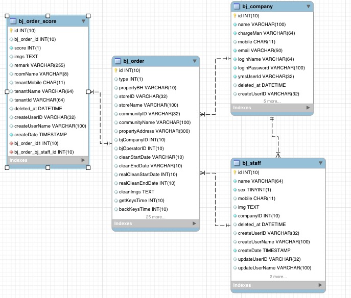

# 数据库结构
       数据库名称：baojie
       数据表：
            bj_order：保洁单
            bj_company：保洁公司
            bj_staff：保洁员
            bj_order_score：保洁单评论
#eer关系图

#字段解释
###bj_order
CREATE TABLE `bj_order` (

  `id` int(10) NOT NULL AUTO_INCREMENT,

  `type` int(1) DEFAULT NULL COMMENT '保洁类型',

  `propertyBH` varchar(10) DEFAULT NULL COMMENT '物业编号',

  `storeID` varchar(32) DEFAULT NULL COMMENT '门店id',

  `storeName` varchar(100) DEFAULT NULL COMMENT '门店名字',

  `communityID` varchar(32) DEFAULT NULL COMMENT '小区ID',

  `communityName` varchar(100) DEFAULT NULL COMMENT '小区名字',

  `propertyAddress` varchar(300) DEFAULT NULL COMMENT '物业地址',

  `bjCompanyID` int(10) DEFAULT NULL COMMENT '保洁公司id',

  `bjOperatorID` int(10) DEFAULT NULL COMMENT '保洁人员',

  `cleanStartDate` varchar(10) DEFAULT NULL COMMENT '要求保洁开始日期',

  `cleanEndDate` varchar(10) DEFAULT NULL COMMENT '要求保洁结束日期',

  `realCleanStartDate` int(10) DEFAULT NULL COMMENT '保洁人员开始保洁时间',

  `realCleanEndDate` int(10) DEFAULT NULL COMMENT '保洁人员结束保洁时间',

  `cleanImgs` text COMMENT '保洁完成图片字符串',

  `getKeysTime` int(10) DEFAULT NULL COMMENT '领取钥匙时间',

  `backKeysTime` int(10) DEFAULT NULL COMMENT '领取钥匙时间',

  `checkDate` int(10) DEFAULT NULL COMMENT '验收时间',

  `checkManID` varchar(32) DEFAULT NULL COMMENT '验收人',

  `checkResultType` tinyint(1) DEFAULT NULL COMMENT '验收结果:1,通过;2,不通过',

  `checkResultRemark` varchar(255) DEFAULT NULL COMMENT '验收备注',

  `checkImgs` text COMMENT '验收图片字符串',

  `orderStatus` int(1) NOT NULL DEFAULT '1',

  `roomName` varchar(8) DEFAULT NULL COMMENT '退租客房名字',

  `deleted_at` datetime DEFAULT NULL COMMENT '数据软删除时间',

  `createUserID` varchar(32) DEFAULT NULL,

  `createUserName` varchar(100) DEFAULT NULL,

  `createDate` timestamp NOT NULL DEFAULT CURRENT_TIMESTAMP ON UPDATE CURRENT_TIMESTAMP,

  `updateUserID` varchar(32) DEFAULT NULL,

  `updateUserName` varchar(100) DEFAULT NULL,

  `updateDate` timestamp NOT NULL DEFAULT '0000-00-00 00:00:00',

  `remark` varchar(255) DEFAULT NULL COMMENT '订单备注',

  `lat` varchar(20) DEFAULT NULL COMMENT '小区经度',

  `lng` varchar(20) DEFAULT NULL COMMENT '小区纬度',

  `file` text COMMENT '导入文件名字',

  `rentType` int(1) DEFAULT NULL COMMENT '物业出租类型',

  `keysNumber` int(3) DEFAULT NULL COMMENT '发放钥匙数量',

  `cancelReason` varchar(255) DEFAULT NULL COMMENT '取消原因',

  `checkManName` varchar(64) DEFAULT NULL COMMENT '验收人员',

  PRIMARY KEY (`id`)

) ENGINE=InnoDB AUTO_INCREMENT=260 DEFAULT CHARSET=utf8

###bj_company
CREATE TABLE `bj_company` (

  `id` int(10) NOT NULL AUTO_INCREMENT,

  `name` varchar(100) NOT NULL DEFAULT '' COMMENT '公司名字',

  `chargeMan` varchar(64) NOT NULL DEFAULT '' COMMENT '负责人',

  `mobile` char(11) DEFAULT NULL COMMENT '手机号码',

  `email` varchar(50) NOT NULL DEFAULT '' COMMENT '邮件',

  `loginName` varchar(64) NOT NULL DEFAULT '' COMMENT 'yms系统登录名',

  `loginPassword` varchar(100) NOT NULL DEFAULT '' COMMENT 'yms系统登录密码',

  `ymsUserId` varchar(32) NOT NULL DEFAULT '' COMMENT 'yms系统用户ID',

  `deleted_at` datetime DEFAULT NULL COMMENT '数据软删除时间',

  `createUserID` varchar(32) DEFAULT NULL,

  `createUserName` varchar(100) DEFAULT NULL,

  `createDate` timestamp NOT NULL DEFAULT CURRENT_TIMESTAMP ON UPDATE CURRENT_TIMESTAMP,

  `updateUserID` varchar(32) DEFAULT NULL,

  `updateUserName` varchar(100) DEFAULT NULL,

  `updateDate` timestamp NOT NULL DEFAULT '0000-00-00 00:00:00',

  PRIMARY KEY (`id`)

) ENGINE=InnoDB AUTO_INCREMENT=28 DEFAULT CHARSET=utf8

###bj_staff
CREATE TABLE `bj_staff` (

  `id` int(10) NOT NULL AUTO_INCREMENT,
  
  `name` varchar(64) NOT NULL COMMENT '姓名',
  
  `sex` tinyint(1) NOT NULL COMMENT '性别',
  
  `mobile` char(11) DEFAULT NULL COMMENT '手机号',
  
  `img` text COMMENT '图片',
  
  `companyID` int(10) NOT NULL COMMENT '公司ID',
  
  `deleted_at` datetime DEFAULT NULL COMMENT '数据软删除时间',
  
  `createUserID` varchar(32) DEFAULT NULL,
  
  `createUserName` varchar(100) DEFAULT NULL,
  
  `createDate` timestamp NOT NULL DEFAULT CURRENT_TIMESTAMP ON UPDATE CURRENT_TIMESTAMP,
  
  `updateUserID` varchar(32) DEFAULT NULL,
  
  `updateUserName` varchar(100) DEFAULT NULL,
  
  `updateDate` timestamp NOT NULL DEFAULT '0000-00-00 00:00:00',
  
  PRIMARY KEY (`id`)

) ENGINE=InnoDB AUTO_INCREMENT=37 DEFAULT CHARSET=utf8

###bj_order_score
CREATE TABLE `bj_order_score` (

  `id` int(10) NOT NULL AUTO_INCREMENT,

  `bj_order_id` int(10) DEFAULT NULL COMMENT '保洁单id',

  `score` int(1) NOT NULL COMMENT '租客评分',

  `imgs` text COMMENT '上传图片',

  `remark` varchar(255) DEFAULT NULL COMMENT '备注',

  `roomName` varchar(8) DEFAULT NULL COMMENT '客房名字',

  `tenantMobile` char(11) DEFAULT NULL COMMENT '租客手机号',

  `tenantName` varchar(64) DEFAULT NULL COMMENT '租客姓名',

  `tenantId` varchar(64) DEFAULT NULL COMMENT '租客id',

  `deleted_at` datetime DEFAULT NULL COMMENT '数据软删除时间',

  `createUserID` varchar(32) DEFAULT NULL,

  `createUserName` varchar(100) DEFAULT NULL,

  `createDate` timestamp NOT NULL DEFAULT CURRENT_TIMESTAMP ON UPDATE CURRENT_TIMESTAMP,

  PRIMARY KEY (`id`)

) ENGINE=InnoDB AUTO_INCREMENT=14 DEFAULT CHARSET=utf8